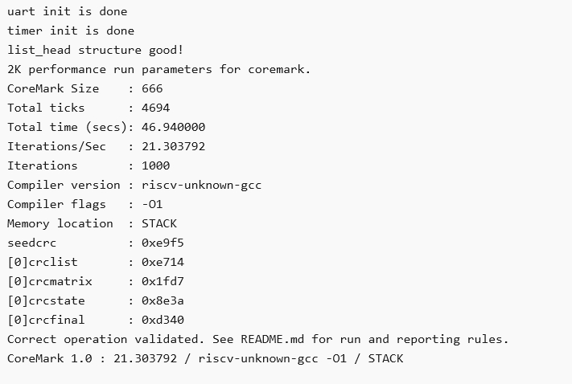

# 2024FPGA创新赛Gaoyun

## 1. 简介

## 2. 系统结构

## 3. 固件文件
mcs:
- core_mark.verilog

说明:
1. core_mark.verilog->coremark跑分测试, itcm: 64k, dtcm: 32k  

## 4. 测试结果

### 4.1 跑分测试

CoreMark跑分: 21.303792

CoreMark跑分榜: [CPU Performance Benchmark – MCU Performance Benchmark – CoreMark – EEMBC Embedded Microprocessor Benchmark Consortium](https://www.eembc.org/coremark/scores.php)

